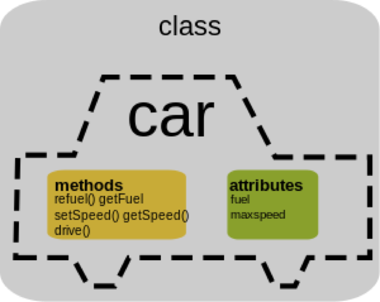

<notice>教程读者请不要直接阅读本文件，因为诸多功能在此无法正常使用，请移步至[程谱 coderecipe.cn](https://coderecipe.cn/learn/8)学习完整教程。如果您喜欢我们的教程，请在右上角给我们一个“Star”，谢谢您的支持！</notice>

类和对象
======

欢迎来到程谱Python面向对象教程第一章节——类和对象😁

类和对象是Python面向对象编程中的思想基础。深入理解类和对象的概念并且熟练掌握其应用将为你的Python学习打下坚实的基础。

开始学习吧！💖

什么是类
------
在现实生活中，我们能见到非常多的“归类”例子，例如，喜鹊、麻雀、乌鸦、燕子等等都属于鸟类，而狮子、老虎、家猫等等都属于猫科动物。在这样的例子中，“鸟类”、“猫科动物”都定义了一个类(class)。

类(class）是定义同一类所有对象的变量和方法的蓝图或原型，描述了所创建的对象共同的属性（状态）和方法（行为）。换言之，类是一个模板，它描述一类对象的行为和状态。

而各种具体的动物（比如某一只猫），则是属于各自类别的一个个实例（instance），也叫对象（object），在后面几节我们会细讲。


由此图可见，从左至右的三辆车各有独自的属性（状态）：颜色、厂家、品牌、动力类型，等等。但他们都作为对象（object）共同属于“车（Car）”这个类。

类的定义方法很简单，如下：
```python
class 类名(object)
  //类的内容
```

之后在介绍继承的时候我们还会介绍括号里的填法，这里我们先记下最简单的用法``(object)``。

属性和方法
------

### 属性
属性（property）是一种变量，只不过这种变量不定义在函数内部，而是定义在整个类里，整个类内都可以访问。定义方式和之前在函数内定义变量的方式差别不大，只不过属性多了一个可选的关键字，等看到本章的“作用域和三个关键字”你就明白了。这个Car类的属性如`fuel`，`maxspeed`等等就属于属性。

### 方法
方法（method）其实就是函数（function），它可以指导一个类中的对象如何执行具体的行为动作，不过一般如果我们想强调这个函数在一个类里面的作用，我们就会用“方法”这个词，比如`refuel()`就是用来操作这些属性的方法。我们还可以用过参数来告诉这个函数具体的内容，比如`setSpeed(double newSpeed)`这个函数就可以让我们给一个浮点参数`newSpeed`，让我们告诉它要设定的车的具体速度，这里的`newSpeed`写在函数定义里，称为形式参数（parameter），形式参数**一定**是要是一个合法的变量名，参数与参数用**逗号**隔开，每一个参数前面**都需要有一个参数类型**。

Python的方法以如下格式呈现：
```python
def 方法名(参数1类型 参数1名, 参数2类型 参数2名...):
  //方法体
```

对于没有参数的函数，参数列表留空即可。

在一个函数里面，我们通过`return`来终止整个函数的运行并给出返回值。
例如`getSpeed()`可以这么定义（假定类里面已经定义了`speed`变量）：
```python
def getSpeed():
  return speed
```

我们还可以定义一个`setSpeed(double newSpeed)`：
```python
def setSpeed(double newSpeed):
  speed = newSpeed
```

### 类内访问方法和属性
如果是在类的内部调用本类的函数，那么直接用如下格式调用即可：
```python
函数名(实际参数列表)
```

比如如果`car`类中的`speedUp`方法要调用`setSpeed`方法加速，就可以直接调用：
```python
setSpeed(getSpeed() + 10) // 把当前的速度加上10作为参数给setSpeed
```
上面的`getSpeed() + 10`作为一个整体，就是实际参数（argument）了，实际参数不需要是一个变量名，它可以是任意的表达式（比如`1+10`，`getSpeed() + 10`），调用函数的时候会先算出这个表达式的值，把这个值给形式参数（比如给了`setSpeed`的`newSpeed`参数），再运行函数的内容。

比如下面这个精简版的``Car``类就定义了一个属性``speed``和一个方法``setSpeed``（在main里没有做操作，因此什么也不会输出）：

<lab lang="python" parameters="filename=car.py">
<notice>练习环境在此无法显示，请移步至[程谱 coderecipe.cn](https://coderecipe.cn/learn/8)查看。</notice>
class Car(object):
   speed = 50 // 定义了一个属性
   def setSpeed(newSpeed):  // 定义了一个方法
      speed = newSpeed // 操作这个属性
</lab>

对象和对象类型
------
一个对象（object），或一个类的实例（instance），指的是类的实体，比如一辆特定的奔驰就是`Car`这个类的实体。每一个对象都有自己的一套属性（比如一辆奔驰和另一辆奔驰的`fuel`燃料就可以不一样多）。 


要从一个类里面新建对象，直接令一个新创建的变量为某个类即可

```python
变量名 = 类名()
```

比如定义一个`myCar`：
```python
myCar = car()
```

这句代码先定义了`car`类型的变量`myCar`，通过类新建了一个实例，并且把这个实例赋值给了一个变量。

如果要调用一个类里面的方法，或是要访问或修改一个类里面的属性，我们可以使用`.`操作符，例如我们可以用`myCar.speed`来访问`myCar`对象的`speed`，也可以用`myCar.setSpeed(90)`来调用`myCar`对象的`setSpeed`方法。

<lab lang="python" parameters="filename=car.py">
<notice>练习环境在此无法显示，请移步至[程谱 coderecipe.cn](https://coderecipe.cn/learn/8)查看。</notice>
class Car(object):
   speed = 0 // 定义了一个属性
   def setSpeed(newspeed): // 定义了一个方法
     speed = newSpeed // 操作这个属性
myCar = car()  //实例化了Car类，命名为myCar
myCar.speed  //调用myCar里的speed属性
myCar.setSpeed(50)  //调用myCar里的setSpeed方法(函数)
</lab>


### 调用类的构造器

类``class``就相当于一个模版，可以通过这个模版创造出各种可以干同一件事，有同一类属性的实例。如果我们在用这个模版创建新物体时**强制需要**传入物体参数时，我们可以定义一个``__init__()``方法来让每次实例化该类时都必须传入某些参数。

```python
class Student(object): //定义一个类，类的名字为student
    def __init__(self,name,gender)  //定义一个__init__方法，self即为这个新创建的实例 
       self.name=name
       self.gender=gender
jerry = Student("Jerry","Male")  //在创建实例时，self本身是不需要输进去的,python会自动传入该实例
```

### 访问限制

有时候，我们不希望其他人随意访问我们某个类里的一些数据，比如说你的电话号码，银行密码等等。这时候我们就可以用到访问限制来进行**封装**，保证数据的隐私性。这时候，我们可以用两个下划线``__变量名``来表示这个变量，这样这个数据就只能从这个类里面被访问了。

```python
class BankAccount(object):
  def __init__(self,password):
    self.__password = password
```

### 封装

如果我们不能直接访问一些隐私性的数据，这时候我们应该如何修改他们呢？这时候我们就可以用到**封装**。我们可以新建一个方法来修改密码。

```python
def setPassword(newPassword):
  self.__password = newPassword
```

小练习
-----
1.Which of the following code segment correctly initialize an object called ``Iphone`` from a class called ``Phone``?


(A) 
```python
initianize Iphone from Phone
```
(B) 
```python
Iphone = Phone(object)
```
(C)
```python
Iphone = Phone()
```
(D)
```python
new Iphone = class Phone()
```
(E)
```python
self.Iphone = Phone()
```

<cr type="hidden"><notice>隐藏内容功能在此无法正常显示，请移步至[程谱 coderecipe.cn](https://coderecipe.cn/learn/8)查看。</notice>C</cr>

### 实验室
在这里练习吧：
<lab lang="python" parameters="filename=Hello.py">
<notice>练习环境在此无法显示，请移步至[程谱 coderecipe.cn](https://coderecipe.cn/learn/8)查看。</notice>
def func():
  //your code goes here
</lab>
